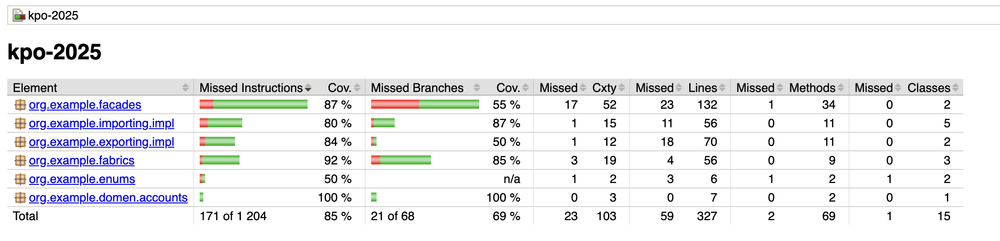

Консольное приложение позволяет создавать, изменять и изменять банковские аккаунты, категории трат и 
банковские операции. Реализована возможность импортировать данные из файлов и выгружать в файл (csv и json).
Покрытие тестами, рассчитанное с помощью jacoco:

ВНИМАНИЕ! если возникли проблемы со сборкой и запуском, напишите пожалуйста в тг @hzhdlrp!!!

# Запуск

Для запуска приложения необходимо запустить функцию src.main.java.service.Main.main

# Команды

Доступные команды:

- create
    - account \<name\> 
        - создает новый аккаунт с именем \<name\>
    - category \<name\> \<type\> (доступные значения \<type\>: "income", "expense")
        - создает новую категорию с названием \<name\> и типом \<type\>
    - operation \<account_name\> \<category_name\> \<amount\>
        - создает операцию для аккаунта с именем \<account_name\> в категории с названием \<category_name\> и суммой \<amount\> 
        - (если тип категории "income", то сумма должна быть положительной, а если "expense" - то отрицательной)
- delete
    - account \<name\>
        - удаляет аккаунт с именем \<name\>
    - operation \<id\>
        - удаляет операцию с id == \<id\>
    - category \<name\>
        - удаляет категорию с именем \<name\>
- change
    - account name \<from\> \<to\>
        - изменяет имя аккаунта с \<from\> на \<to\>
    - category name \<from\> \<to\>
        - изменяет имя категории с \<from\> на \<to\>
- import csv\\json
    - accounts\\operations\\categories \<filename\>
        - импортирует из файла \<filename\> с типом csv\\json
- export csv\\json
    - accounts\\operations\\categories
        - экспортирует в тип csv\\json
- end
    - завершает работу

# Используемые паттерны проектирования

Паттерн проектирования Шаблонный метод - использовался для импорта из json\\csv и экспорта в json\\csv. 
Интрефейс Importer имеет методы readAccounts, readCategories, readOperations, а в папке impl различные реализации 
этого интерфейса, уже используемые для обработки конкретного формата. Аналогично для Exporter.

Паттерны проектирования Фабрика и Одиночка (Синглтон) - для создания экземпляров доменных классов Accounts, 
Category, Operation написаны фабрики AccountsFabric, CategoryFabric, OperationsFabric, окторые, к тому же,
являются синглтонами, и вызываются с помощью getInstance().

Паттерн проектирования Строитель - для доменных классов Accounts, Category, Operation
использовался Builder из lombok. Пример использования - в AccountsFabric::createAccount:

    return BankAccount.builder()
        .balance(0)
        .accountId(id_counter)
        .accountName(name)
        .build();

Паттерн проектирования Фасад - есть фасад UserFacade, который создает интерфейс для взаимодействия со всей программой, 
а так же из-за того, что с классом BankAccount нужно было произвоить достаточно много операций, был создан BankAccountFacade, 
который используется в свою очередь  внутри UserFacade

Паттерн проектирования Посетитель - в методах export... в UserFacade exporter принимает массив экземпляров доменных классов, 
и "посещает" каждый из них, выполняя определенные действия 

    exporter.writeOperations(operationsList);

Итого было успешно применено 6 паттернов проектирования 

# SOLID и GRASP

Принцип единой ответственности - отдельный доменный класс для каждой сущности, отдельные обработчики для импорта
 и экспорта, не смешанные в единый класс. 

Принцип подстановки (Лисков) - в UserFacade используются методы интерфейсов Importer и Exporter, и все работает 
корректно после подстановки любой из реализаций интерфейсов. 

Тут же можно сказать, что UserFacade не зависит от реализации Importer и Exporter, поэтому это разделение интерфейсов и инверсия 
зависимости, а еще полиморфизм, так как мы работаем с разными реализациями

Ответственность назначенна классам, которые обладают всей необходимой информацией, например, ответственность за работу
с аккаунтами назначена BankAccountFacade

Ответственность за создание объектов лежит на тех объектах, которые их используют. Например, BankAccountFacade использует AccountsFabric, 
чтобы выполнять все операции с аккантами, и предоставлять UserFacade интерфейс взаимодействия

Все методы четко связаны с обязанностями (например, в UserFacade методы буквально названы как команды в командной строке, которые их вызывают,
и выполняют конкретно одну данную функцию)

Внутренние компоненты классов защищены от изменения извне (все что не нужно изменять извне - private, во всех доменных
классах используются геттеры)

