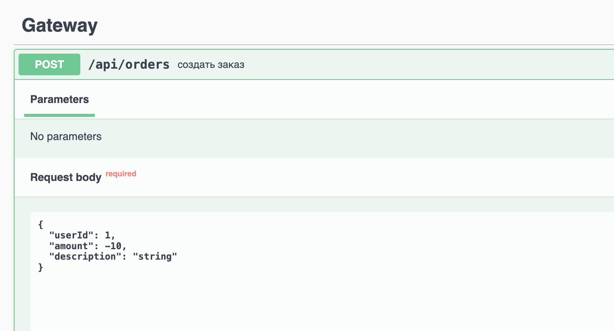
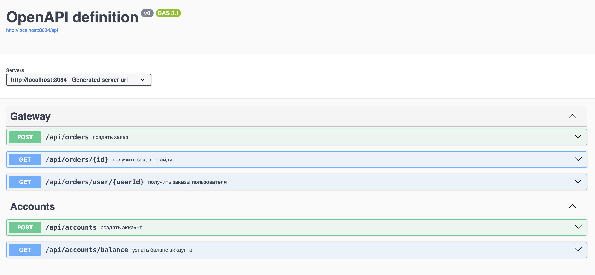
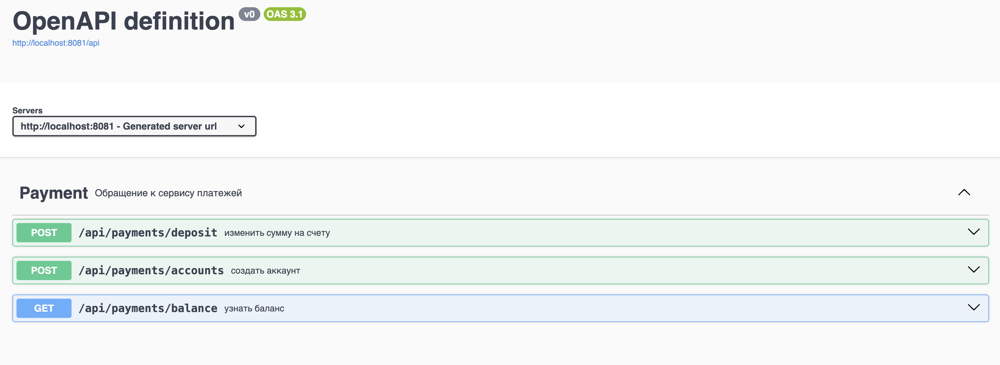
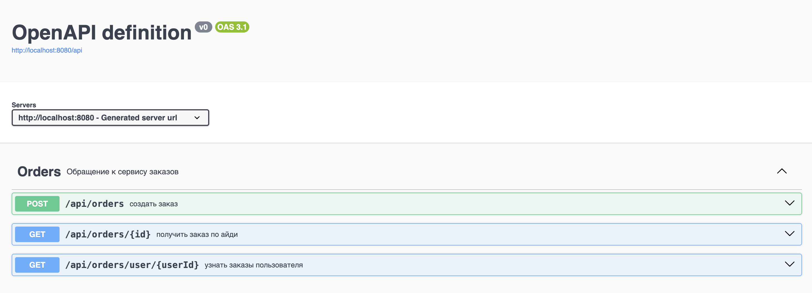
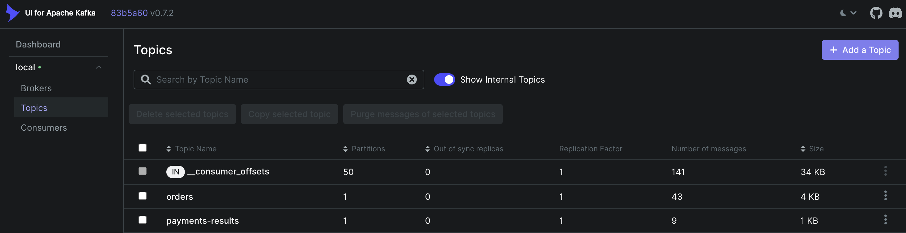

# Запуск
При ошибках писать: https://t.me/hzhdlrp

Для запуска всех сервисов необходимо из директории src выполнить
```
    docker-compose -f docker-compose.yml build
    docker-compose -f docker-compose-kafka.yml up
    docker-compose -f docker-compose.yml up
```
# Структура и API

Приложение состоит из трех микросервисов: gateway, order, payment. Предполагается, что пользователь взаимодействует с сервисом gateway,
который перенаправляет запросы остальным сервисам. 

Можно создать пользователя по айди, посмотреть его баланс, создать заказ, получить заказ по айди и получить все заказы пользователя.
Gateway отправляет синхронные rest-запросы сервисам order и payment, при обработке заказа order и payment асинхронно общаются через брокера сообщений
(Kafka), следуя паттернам Transactional Outbox и Transactional Inbox. 

## ВНИМАНИЕ!!! 
Сервис устроен так, что каждый заказ ОТНИМАЕТ количество денег, записанное в поле amount. Так
 как изначально аккаунты создаются с нулевым балансом, чтобы пополнить его, пожалуйста, создайте несколько заказов с отрицательным amount
(да костыль, и что, завтра дедлайн)



Чтобы протестировать функционал каждого сервиса, можно подключиться к единому Swagger-у с выбором сервиса. Он запускается на порте 8083
(http://localhost:8083/)

Kafka-UI можно открыть по адресу http://localhost:8082/

Скрины:






