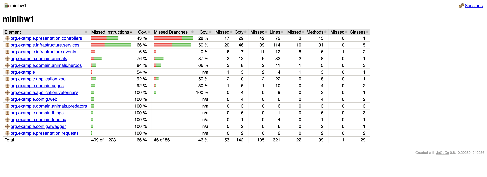
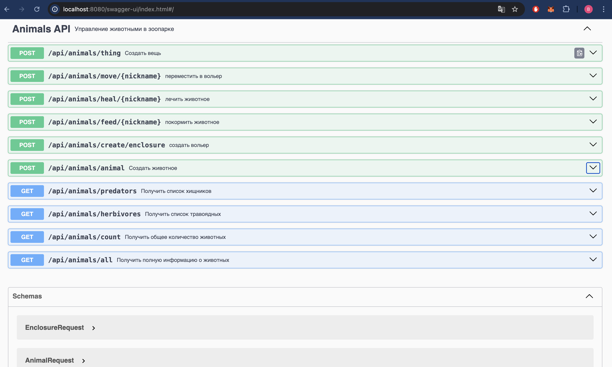

# Запуск

Для запуска приложения необходимо запустить функцию src.main.java.org.example.Main.main
Дефолтное значение критерия здоровья - 20

ВНИМАНИЕ! если возникли проблемы со сборкой и запуском, напишите пожалуйста в тг @hzhdlrp!!!

# Описание

Реализовано веб-приложение для управления животными, вольерами, расписанием кормлений.

Приложение реализовано согласно принципам Clean Architecture и состоит из следующих модулей: 
- application для логики работы приложения, в частности Zoo и VetClinic
- domain для доменных классов, реализованных как Value Object, в частности для вольеров, животных и вещей (здесь же интерфейсы и абстрактные классы для них, чтобы зависимости в другие модули реализовывать через них)
- infrastructure для внешних взаиможействий, в частности для сервисов, включающих im-memory хранилища, и event-ов
- presentation для контроллера и классов, описывающих запросы
а так же конфигураций в директории config

класс для работы с консолью был удален

Покрытие тестами, рассчитанное с помощью jacoco (MINIHW1 это название директории с первой домашки, можно считать, что это просто minihw, на данный момент minihw2):




прошу заметить, что тестами покрыто 66% (более 65% :))


# Web API

Вот так эта шайтан-машина выглядит в сваггере:



Как пользоваться (список так называемых эндпоинтов):


### Создать животное

**POST** `/animal`

**Request Body (JSON):**
```json
{
  "type": "monkey",
  "health": 50,
  "nickname": "Bimbo",
  "sex": "male",
  "favoriteFood": "banana"
}
```

### Создать вещь
**POST** `/thing`

**Request Body (String):**

```table```


### Покормить животное
**POST** `/feed/{nickname}`

Пример:

```POST /feed/Bimbo```

### Полечить животное
**POST** `/heal/{nickname}`

Пример:

```POST /heal/Bimbo```


### Переместить животное в вольер
**POST** `/move/{nickname}`

Request Body (JSON):

```json
10
```

### Создать вольер
**POST** `/create/enclosure`

Request Body (JSON):

```json
{
  "capacity": 3,
  "type": "herbo"
}
```


### Получить информацию
### Общее количество животных
**GET** `/count`

Response:

```json
42
```
### Список травоядных
**GET** `/herbivores`

Response:

```json
["Zebra Марти", "Monkey Бамбук"]
```
### Список хищников
**GET** `/predators`

Response:

```json
["Tiger Шерхан", "Wolf Акелла"]
```
### Полная информация обо всех животных
**GET** `/all`

Response:

```json
[
  "Tiger Matras(Health: 20, Favorite food: meat, Sex: male, Food value: 20, Status: healthy)",
  "Monkey Bimbo(Health: 50, Favorite food: banana, Sex: male, Food value: 10, Status: hungry)"
]
```

⚠️ Коды ошибок

Код	 Значение

200	 Успех

666	 Ошибка (детали в теле ответа)

